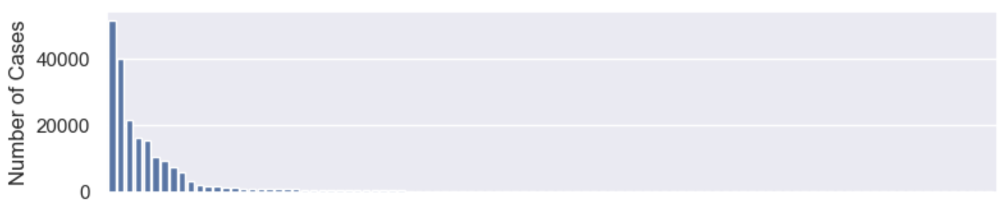
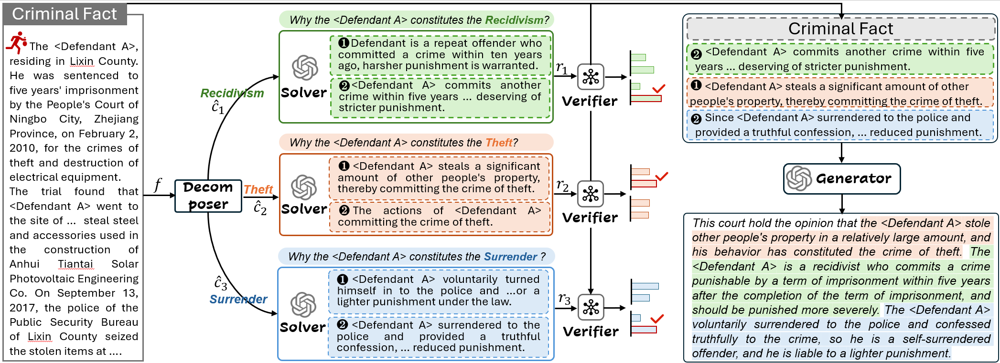

# Divide and Conquer:Legal Concept-guided Criminal Court View Generation

## Introduction
In this study, we introduce a new benchmark named LCVG with annotated legal concepts. Based on the dataset, we propose a legal concept-guided court view generation framework (LeGen). Specifically, given the fact, LeGen first divides the court view into several sub-views based on the predicted legal concepts. Then the solver and verifier are employed to generate and select rationales respectively. Finally, the court view is generated by incorporating the fact and rationales. Experiments on the real word dataset demonstrate the effectiveness of our proposed method.

## Dataset
| Item | LCVG  |
|--------|--------|
| \# Train set | 60,744 | 
| \# Development set | 20,257  | 
| \# Test set | 20,290    | 
| \# Type of legal concept | 101 | 
| \# Avg. Legal Concept per case | 2.1  | 
| \# Avg. Length of fact | 781.4 | 
| \# Avg. Length of rationale | 52.8 | 
| \# Avg. Length of court view| 245.9 | 

[LeGen dataset Link](https://pan.baidu.com/s/1GsdoAVcd7KavY3Tz7SHZyA?pwd=g2zd)


## Example
```
{
    "id": 2467072, 
    "name": "司某某 
    "bg_info": "司某某，1981年2月12日出生于河xx省石家庄市无极县，初中文化，群众，务农，曾因犯交通肇事罪于2014年7月23日被无极县人民法院判处有期徒刑一年零六个月，缓刑二年。 
    "fact": "经审理查明：2017年6月6日司某某通过微信与受害人安某1相识，并称自己是无极司法局的“李某”。后司某某以其朋友需要购买减肥药为名，将受害人约至无极县七汲镇见面，... 
    "legal_concept": {
        "criminal_circumstance": [["盗窃罪 "司某某以非法占用为目的，秘密窃取他人财物，数额较大，其行为已构成盗窃罪 ["第二百六十四条"]]], 
        "sentence_circumstance": [["缓刑 "结合司某某家庭情况和河北省无极县司法局出具的《调查评估意见书》，对司某某适用缓刑不致再危害社会，对其居住地没有重大不良影响，可以对其宣告缓刑，在缓刑考验期内依法实行社区矫正 ["第七十二条 "第七十三条"]]]}, 
    "court_view": "本院认为，被告人司某某以非法占用为目的，秘密窃取他人财物，数额较大，其行为已构成**盗窃罪**。公诉机关指控被告人司某某犯盗窃罪的事实清楚，证据确实充分，指控罪名成立，应当依法惩处。...结合被告人司某某家庭情况和河北省无极县司法局出具的《调查评估意见书》，对被告人司某某适用缓刑不致再危害社会，对其居住地没有重大不良影响，可以对其宣告缓刑，在缓刑考验期内依法实行社区矫正。"
}
```


## Legal Concept Distribution
The legal concept has a long-tail distribution. which impact the performance of the Decomposer module. We will explore the problem in the future work.


## Example of Legal Concept Definition
The legal concepts are clearly defined in the Chinese Criminal Law. For example, the Article 67 define the legal concept *Voluntary Surrender*.

```
    【故意犯罪】明知自己的行为会发生危害社会的结果，并且希望或者放任这种结果发生，因而构成犯罪的，是故意犯罪。\n\n故意犯罪，应当负刑事责任。
    【过失犯罪】应当预见自己的行为可能发生危害社会的结果，因为疏忽大意而没有预见，或者已经预见而轻信能够避免，以致发生这种结果的，是过失犯罪。\n\n过失犯罪，法律有规定的才负刑事责任。
    【刑事责任年龄】已满十六周岁的人犯罪，应当负刑事责任。\n\n已满十四周岁不满十六周岁的人，犯故意杀人、故意伤害致人重伤或者死亡、强奸、抢劫、贩卖毒品、放火、爆炸、投毒罪的，应当负刑事责任。\n\n已满十四周岁不满十八周岁的人犯罪，应当从轻或者减轻处罚。\n\n因不满十六周岁不予刑事处罚的，责令他的家长或者监护人加以管教；在必要的时候，也可以由政府收容教养。已满七十五周岁的人故意犯罪的，可以从轻或者减轻处罚；过失犯罪的，应当从轻或者减轻处罚。
    【特殊人员的刑事责任能力】精神病人在不能辨认或者不能控制自己行为的时候造成危害结果，经法定程序鉴定确认的，不负刑事责任，但是应当责令他的家属或者监护人严加看管和医疗；在必要的时候，由政府强制医疗。\n\n间歇性的精神病人在精神正常的时候犯罪，应当负刑事责任。\n\n尚未完全丧失辨认或者控制自己行为能力的精神病人犯罪的，应当负刑事责任，但是可以从轻或者减轻处罚。\n\n醉酒的人犯罪，应当负刑事责任。
    【犯罪预备】为了犯罪，准备工具、制造条件的，是犯罪预备。\n\n对于预备犯，可以比照既遂犯从轻、减轻处罚或者免除处罚。
    【犯罪未遂】已经着手实行犯罪，由于犯罪分子意志以外的原因而未得逞的，是犯罪未遂。\n\n对于未遂犯，可以比照既遂犯从轻或者减轻处罚。
    【犯罪中止】在犯罪过程中，自动放弃犯罪或者自动有效地防止犯罪结果发生的，是犯罪中止。\n\n对于中止犯，没有造成损害的，应当免除处罚；造成损害的，应当减轻处罚。
    【共同犯罪概念】共同犯罪是指二人以上共同故意犯罪。\n\n二人以上共同过失犯罪，不以共同犯罪论处；应当负刑事责任的，按照他们所犯的罪分别处罚。
    【主犯】组织、领导犯罪集团进行犯罪活动的或者在共同犯罪中起主要作用的，是主犯。\n\n三人以上为共同实施犯罪而组成的较为固定的犯罪组织，是犯罪集团。\n\n对组织、领导犯罪集团的首要分子，按照集团所犯的全部罪行处罚。\n\n对于第三款规定以外的主犯，应当按照其所参与的或者组织、指挥的全部犯罪处罚。
    【从犯】在共同犯罪中起次要或者辅助作用的，是从犯。\n\n对于从犯，应当从轻、减轻处罚或者免除处罚。
    【一般累犯】被判处有期徒刑以上刑罚的犯罪分子，刑罚执行完毕或者赦免以后，在五年以内再犯应当判处有期徒刑以上刑罚之罪的，是累犯，应当从重处罚，但是过失犯罪和不满十八周岁的人犯罪的除外。\n\n前款规定的期限，对于被假释的犯罪分子，从假释期满之日起计算。
    【特别累犯】危害国家安全犯罪、恐怖活动犯罪、黑社会性质的组织犯罪的犯罪分子，在刑罚执行完毕或者赦免以后，在任何时候再犯上述任一类罪的，都以累犯论处。
    【自首】犯罪以后自动投案，如实供述自己的罪行的，是自首。对于自首的犯罪分子，可以从轻或者减轻处罚。其中，犯罪较轻的，可以免除处罚。\n\n被采取强制措施的犯罪嫌疑人、被告人和正在服刑的罪犯，如实供述司法机关还未掌握的本人其他罪行的，以自首论。\n\n犯罪嫌疑人虽不具有前两款规定的自首情节，但是如实供述自己罪行的，可以从轻处罚；因其如实供述自己罪行，避免特别严重后果发生的，可以减轻处罚。
    【非法经营罪】违反国家规定，有下列非法经营行为之一，扰乱市场秩序，情节严重的，处五年以下有期徒刑或者拘役，并处或者单处违法所得一倍以上五倍以下罚金；情节特别严重的，处五年以上有期徒刑，并处违法所得一倍以上五倍以下罚金或者没收财产：\n\n(一)未经许可经营法律、行政法规规定的专营、专卖物品或者其他限制买卖的物品的；\n\n(二)买卖进出口许可证、进出口原产地证明以及其他法律、行政法规规定的经营许可证或者批准文件的；\n\n(三)未经国家有关主管部门批准非法经营证券、期货、保险业务的，或者非法从事资金支付结算业务的；\n\n(四)其他严重扰乱市场秩序的非法经营行为。
    【故意杀人罪】故意杀人的，处死刑、无期徒刑或者十年以上有期徒刑；情节较轻的，处三年以上十年以下有期徒刑。
```
## Framework



## Setup
Please install all the required packages first by running the following command:

```
pip install -r requirements.txt 
```

## Quick Start

trian the decomposer
```
python decomposer_train.py
```

trian the verifier
```
python verifier_train.py
```

trian the solver
```
 CUDA_VISIBLE_DEVICES=0,1 deepspeed --master_port 29500 solver_and_generator_train.py \
                --ds_file ds_zero2_no_offload.json \
                --train_file data/solver_sft.json \
                --max_len 1560 \
                --max_src_len 1024 \
                --model_path glm3/ \
                --lora_dim 16 \
                --lora_alpha 64 \
                --lora_dropout 0.1 \
                --lora_module_name "query_key_value,dense_h_to_4h,dense_4h_to_h,dense" \
                --output_dir ./solver \
                --train_batch_size_per_device 1 \
                --gradient_accumulation_steps 4 \
                --learning_rate 1e-5 \
                --weight_decay 0.1 \
                --num_train_epoch 10 \
                --warmup_ratio 0.1 \
                --seed 2333 \
                --show_loss_step 50 \
                --save_model_step 50
```

trian the generator
```
CUDA_VISIBLE_DEVICES=0,1 deepspeed --master_port 29500 solver_and_generator_train.py \
                --ds_file ds_zero2_no_offload.json \
                --train_file data/generator_sft.json \
                --max_len 2048 \
                --max_src_len 1560 \
                --model_path glm3/ \
                --lora_dim 16 \
                --lora_alpha 64 \
                --lora_dropout 0.1 \
                --lora_module_name "query_key_value,dense_h_to_4h,dense_4h_to_h,dense" \
                --output_dir ./generator \
                --train_batch_size_per_device 1 \
                --gradient_accumulation_steps 4 \
                --learning_rate 1e-5 \
                --weight_decay 0.1 \
                --num_train_epoch 10 \
                --warmup_ratio 0.1 \
                --seed 2333 \
                --show_loss_step 50 \
                --save_model_step 50
```
